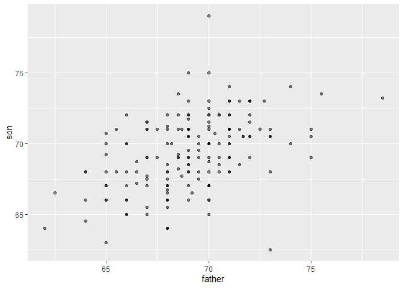
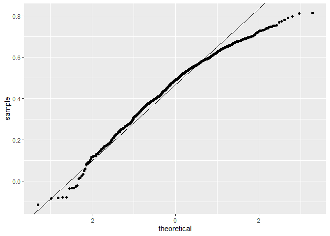
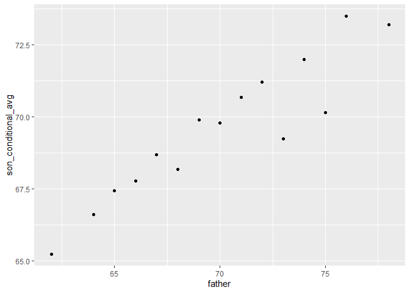
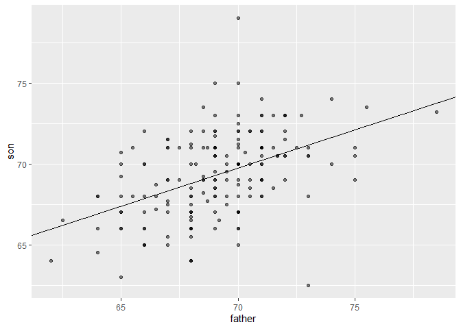
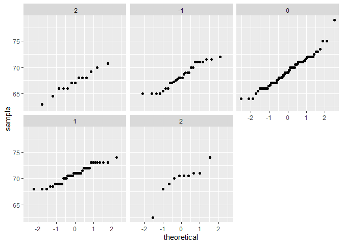
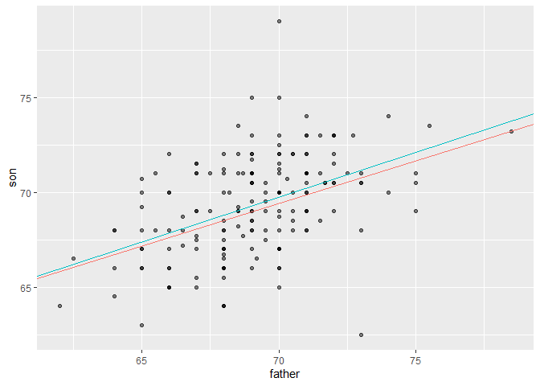

## Setup


```r
knitr::opts_chunk$set(echo = TRUE)

# Required Libraries
library(HistData)
library(tidyverse)

# Data used
data("GaltonFamilies")


# Setup variables
galton_heights <- GaltonFamilies %>%
  filter(gender == "male") %>%
  group_by(family) %>%
  sample_n(1) %>%
  ungroup() %>%
  select(father, childHeight) %>%
  rename(son = childHeight)

# As this study deals with random variables, a seed will be set. Feel free to run this without a seed to find the variance in results.
set.seed(2021)
```

## Introduction

This is an R Markdown document used to organize and display the code I have written for my case study in the famous 1885 study of Francis Galton exploring the relationship between the heights of adult children and the heights of their parents for my class in linear regression. 


```r
# means and standard deviations
galton_heights %>%
  summarize(mean(father), sd(father), mean(son), sd(son))
```

```
## # A tibble: 1 x 4
##   `mean(father)` `sd(father)` `mean(son)` `sd(son)`
##            <dbl>        <dbl>       <dbl>     <dbl>
## 1           69.1         2.55        69.3      2.61
```


```r
# scatterplot of father and son heights
galton_heights %>%
  ggplot(aes(father, son)) +
  geom_point(alpha = 0.5)
```

<!-- -->

### Calculating Correlation Coefficient

Using the following examples, we may calculate the correlation coefficient to determine how related two variables are, conveying how they move together. The correlation coefficient is defined for a list of pairs $(x_1, y_1), \dots, (x_n,y_n)$ as the product of the standardized values, so the formula is as follows:

$$
\rho = \frac{1}{n} \sum_{i=1}^n \left( \frac{x_i-\mu_x}{\sigma_x} \right)\left( \frac{y_i-\mu_y}{\sigma_y} \right)
$$
Using this formula we can calculate the correlation coefficient between the father and sons height.


```r
# Calculating correlation coefficient
galton_heights %>% summarize(r = cor(father, son)) %>% pull(r)
```

```
## [1] 0.461157
```

Since correlation is calculated based on a sample of data, we may further limit the sample size to see how the correlation may be warped.


```r
# compute sample correlation
R <- sample_n(galton_heights, 25, replace = TRUE) %>%
  summarize(r = cor(father, son))
R
```

```
## # A tibble: 1 x 1
##       r
##   <dbl>
## 1 0.527
```

And run a monte-carlo simulation of the sample correlation:


```r
# Monte Carlo simulation to show distribution of sample correlation
B <- 1000
N <- 25
R <- replicate(B, {
  sample_n(galton_heights, N, replace = TRUE) %>%
    summarize(r = cor(father, son)) %>%
    pull(r)
})
qplot(R, geom = "histogram", binwidth = 0.05, color = I("black"))
```

<!-- -->


```r
# expected value and standard error
mean(R)
```

```
## [1] 0.4657164
```

```r
sd(R)
```

```
## [1] 0.1594211
```

Finally we can calculate if a sample size (N) is large enough by creating a QQ-plot


```r
# QQ-plot to evaluate whether N is large enough
data.frame(R) %>%
  ggplot(aes(sample = R)) +
  stat_qq() +
  geom_abline(intercept = mean(R), slope = sqrt((1-mean(R)^2)/(N-2)))
```

<!-- -->

## Stratification

To improve the estimates of the conditional expectations we can define strata with similar heights.

For example, we may want to calculate the predicted height of a son with a specific height of the fathers, like so:


```r
# predicted height of a son with a 72 inch tall father
conditional_avg <- galton_heights %>%
    filter(round(father) == 72) %>%
    summarize(avg = mean(son)) %>%
    pull(avg)
conditional_avg
```

```
## [1] 71.21429
```

Stratification allows us to use boxplots to find the distribution of each group (between fathers/sons)


```r
# stratify fathers' heights to make a boxplot of son heights
galton_heights %>% mutate(father_strata = factor(round(father))) %>%
    ggplot(aes(father_strata, son)) +
    geom_boxplot() +
    geom_point()
```

<!-- -->

The center of each group rises with height, and the means of each group follow a linear relationship (which we can show with the follow plot).


```r
# center of each boxplot
galton_heights %>%
    mutate(father = round(father)) %>%
    group_by(father) %>%
    summarize(son_conditional_avg = mean(son)) %>%
    ggplot(aes(father, son_conditional_avg)) +
    geom_point()
```

<!-- -->

#### Regression

Finally we may calculate the regression line to get a more clear understanding of the two variables.

If there is perfect correlation, the regression line predicts an increase that is the same number of SDs for both variables. If there is 0 correlation, then we don’t use x at all for the prediction and simply predict the average $μ_y$. For values between 0 and 1, the prediction is somewhere in between. If the correlation is negative, we predict a reduction instead of an increase.

The formula for the regression is as follows:

$$ 
\left( \frac{Y-\mu_Y}{\sigma_Y} \right) = \rho \left( \frac{x-\mu_X}{\sigma_X} \right)
$$
or rewritten like:

$$ 
Y = \mu_Y + \rho \left( \frac{x-\mu_X}{\sigma_X} \right) \sigma_Y
$$
This may be more clearly understood in the common slope formula of $y = mx + b$ where the slope is $m = \rho \frac{\sigma_y}{\sigma_x}$ with an intercept of $b = \mu_y - m \mu_x$.


```r
# calculate values to plot regression line on original data
mu_x <- mean(galton_heights$father)
mu_y <- mean(galton_heights$son)
s_x <- sd(galton_heights$father)
s_y <- sd(galton_heights$son)
r <- cor(galton_heights$father, galton_heights$son)
m <- r * s_y/s_x
b <- mu_y - m*mu_x

# add regression line to plot
galton_heights %>%
    ggplot(aes(father, son)) +
    geom_point(alpha = 0.5) +
    geom_abline(intercept = b, slope = m)
```

<!-- -->


### Bivariate Normal Distribution

Although we have the regression line, we must also determine if the two variables can be approximated by the bivariate normal distribution. This is because when two variables follow a bivariate normal distribution, computing the regression line is equivalent to computing conditional expectations.

If the height data is well-approximated for the bivariate normal distribution then we should see the normal approximation hold for each grouping. We can determine this by using the following plot, which stratifies the son heights by the standardized father heights.


```r
galton_heights %>%
  mutate(z_father = round((father - mean(father)) / sd(father))) %>%
  filter(z_father %in% -2:2) %>%
  ggplot() +  
  stat_qq(aes(sample = son)) +
  facet_wrap( ~ z_father)
```

<!-- -->

Note, the expected value of x given y is *not* the inverse of y given x. If we wanted the to compute predict the father's height from the son's, we would need to compute the regression line again.


```r
# Regression line of fathers heights based on the sons heights.
slope <-  r * s_x / s_y
intercept <- mu_x - slope*mu_y

slope
```

```
## [1] 0.4491833
```

```r
intercept
```

```
## [1] 37.96471
```

Adding this linear regression line to the plot we get the following:
(with the regression line of fathers heights based on sons heights in blue, and the regression line of sons heights based on fathers heights in red.)


```r
galton_heights %>%
    ggplot(aes(father, son)) +
    geom_point(alpha = 0.5) +
    geom_abline(aes(slope = m, intercept = b, colour = "red")) +
    geom_abline(aes(slope = slope, intercept = intercept, colour = "blue")) +
    theme(legend.position = "none")
```

<!-- -->
