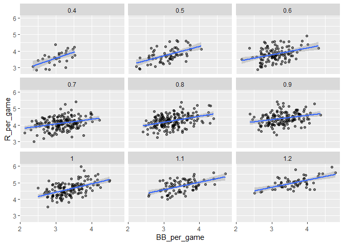
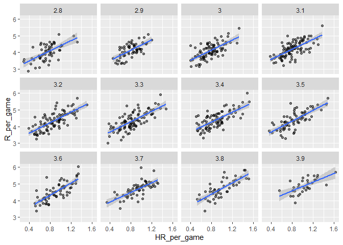

## Setup


```r
knitr::opts_chunk$set(echo = TRUE)

# Required Libraries
library(dslabs)
library(Lahman)
library(tidyverse)


# Setup variables
team_stats <- Teams %>% filter(yearID %in% 1961:2001)
```

## Introduction

This is an R Markdown document used to organize and display the code I have written for my case study in sabermetrics in my class for linear regression. More specifically, this document highlights relations between baseball players and their contributions to the team, and how we can use linear regression to calculate their effectiveness.


```r
team_stats %>%
  mutate(HR_per_game = HR / G, R_per_game = R / G) %>%
  ggplot(aes(HR_per_game, R_per_game)) + 
  geom_point(alpha = 0.5) + 
  ggtitle("Scatterplot of the Relationship between HRs and Runs") +
  xlab("Home Runs Per Game") + ylab("Runs Per Game")
```

<!-- -->

### Calculating Correlation Coefficient

Using the following examples, we may calculate the correlation coefficient to determine how related two variables are, conveying how they move together. The correlation coefficient is defined for a list of pairs $(x_1, y_1), \dots, (x_n,y_n)$ as the product of the standardized values, so the formula is as follows:

$$
\rho = \frac{1}{n} \sum_{i=1}^n \left( \frac{x_i-\mu_x}{\sigma_x} \right)\left( \frac{y_i-\mu_y}{\sigma_y} \right)
$$

With this we may now determine how variables baseball variables move together.


```r
team_stats %>%
  mutate(AB_per_game = AB / G, R_per_game = R / G) %>%
  ggplot(aes(AB_per_game, R_per_game)) + 
  geom_point(alpha = 0.5) + 
  ggtitle("Scatterplot of the Relationship between At Bats and Runs") +
  xlab("At Bats Per Game") + ylab("Runs Per Game")
```

<!-- -->

```r
# Calculate correlation coefficient between runs per game and at bats per game
team_stats %>% 
  mutate(AB_per_game = AB / G, R_per_game = R / G) %>% 
  summarize(r = cor(AB_per_game, R_per_game)) %>% pull(r)
```

```
## [1] 0.6580976
```

We can see a relatively strong direct correlation between the number of runs and the number of at bats per game. This is also evident by the linearity of the graph. This makes perfect sense, as a team would obviously get more runs the more changes (at bats) they receive.


```r
team_stats %>%
  mutate(win_rate = W / G, E_per_game = E / G) %>%
  ggplot(aes(win_rate, E_per_game)) + 
  geom_point(alpha = 0.5) + 
  ggtitle("Scatterplot of the relationship between Win Rate and Number of Fielding Errors") +
  xlab("Wins Per Game") + ylab("Fielding Errors Per Game")
```

<!-- -->

```r
# Calculate correlation coefficient between win rate and errors per game
team_stats %>% 
  mutate(win_rate = W / G, E_per_game = E / G) %>% 
  summarize(r = cor(win_rate, E_per_game)) %>% pull(r)
```

```
## [1] -0.3396947
```

We can see a weaker inverse correlation between the win rate and the number of fielding errors per game.


```r
team_stats %>%
  mutate(X3B_per_game = X3B / G, X2B_per_game = X2B / G) %>%
  ggplot(aes(X3B_per_game, X2B_per_game)) + 
  geom_point(alpha = 0.5) + 
  ggtitle("Scatterplot of the relationship between Triples and Doubles") +
  xlab("Wins Per Game") + ylab("Fielding Errors Per Game")
```

<!-- -->

```r
# Calculate correlation coefficient between triples and doubles
team_stats %>% 
  mutate(X3B_per_game = X3B / G, X2B_per_game = X2B / G) %>% 
  summarize(r = cor(X3B_per_game, X2B_per_game)) %>% pull(r)
```

```
## [1] -0.01157404
```

We can see a very very weak inverse correlation between the number of triples and the number of doubles per game. Since this correlation coefficient is so close to 0, we may as well say there is no correlation in this relationship. This is also evident by the amount of scatter in the plot.

## Confounding

Using the previous techniques we can determine that the slope of the regression line between Bases on Balls and runs is 0.735. It may appear as though Bases on Balls causes a lot of runs, however, that may not necessarily be the case. 


```r
# calculate correlation between HR, BB and singles
Teams %>% 
  filter(yearID %in% 1961:2001 ) %>% 
  mutate(Singles = (H-HR-X2B-X3B)/G, BB = BB/G, HR = HR/G) %>%  
  summarize(cor(BB, HR), cor(Singles, HR), cor(BB,Singles))
```

```
##   cor(BB, HR) cor(Singles, HR) cor(BB, Singles)
## 1   0.4039313       -0.1737435      -0.05603822
```


It turns out home run players are given more bases on balls to avoid letting them hit home runs. In this case, we say Bases on Balls are confounded with Home Runs.

To determine if Bases on Balls are actually useful for creating runs, we can fix home runs at a certain value and reexamine the relation between runs and Bases on Balls.


```r
# stratify HR per game to nearest 10, filter out strata with few points
dat <- Teams %>% filter(yearID %in% 1961:2001) %>%
  mutate(HR_strata = round(HR/G, 1), 
         BB_per_game = BB / G,
         R_per_game = R / G) %>%
  filter(HR_strata >= 0.4 & HR_strata <=1.2)
  
# scatterplot for each HR stratum
dat %>% 
  ggplot(aes(BB_per_game, R_per_game)) +  
  geom_point(alpha = 0.5) +
  geom_smooth(method = "lm") +
  facet_wrap( ~ HR_strata)
```

```
## `geom_smooth()` using formula 'y ~ x'
```

<!-- -->

```r
# calculate slope of regression line after stratifying by HR
dat %>%  
  group_by(HR_strata) %>%
  summarize(slope = cor(BB_per_game, R_per_game)*sd(R_per_game)/sd(BB_per_game))
```

```
## # A tibble: 9 x 2
##   HR_strata slope
## *     <dbl> <dbl>
## 1       0.4 0.734
## 2       0.5 0.566
## 3       0.6 0.412
## 4       0.7 0.285
## 5       0.8 0.365
## 6       0.9 0.261
## 7       1   0.512
## 8       1.1 0.454
## 9       1.2 0.440
```

```r
# stratify by BB
dat <- Teams %>% filter(yearID %in% 1961:2001) %>%
  mutate(BB_strata = round(BB/G, 1), 
         HR_per_game = HR / G,
         R_per_game = R / G) %>%
  filter(BB_strata >= 2.8 & BB_strata <=3.9) 

# scatterplot for each BB stratum
dat %>% ggplot(aes(HR_per_game, R_per_game)) +  
  geom_point(alpha = 0.5) +
  geom_smooth(method = "lm") +
  facet_wrap( ~ BB_strata)
```

```
## `geom_smooth()` using formula 'y ~ x'
```

<!-- -->

```r
# slope of regression line after stratifying by BB
dat %>%  
  group_by(BB_strata) %>%
  summarize(slope = cor(HR_per_game, R_per_game)*sd(R_per_game)/sd(HR_per_game))
```

```
## # A tibble: 12 x 2
##    BB_strata slope
##  *     <dbl> <dbl>
##  1       2.8  1.52
##  2       2.9  1.57
##  3       3    1.52
##  4       3.1  1.49
##  5       3.2  1.58
##  6       3.3  1.56
##  7       3.4  1.48
##  8       3.5  1.63
##  9       3.6  1.83
## 10       3.7  1.45
## 11       3.8  1.70
## 12       3.9  1.30
```

It appears that when we stratify by home runs, we have an approximately bivariate normal distribution for runs versus bases on balls. If we stratify by bases on balls, we have an approximately normal bivariate distribution for runs versus home runs.


