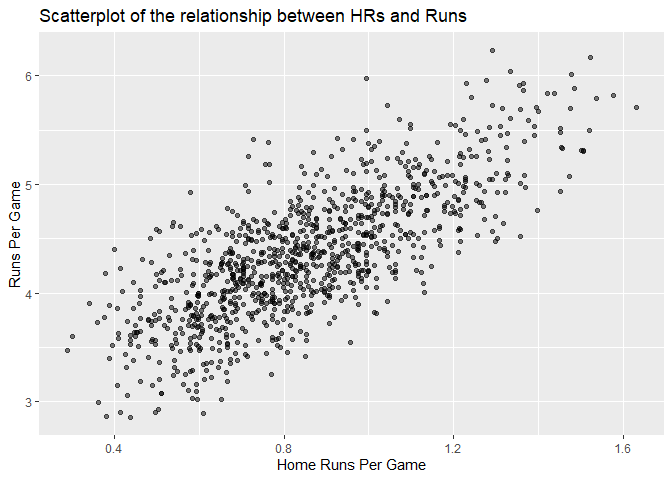
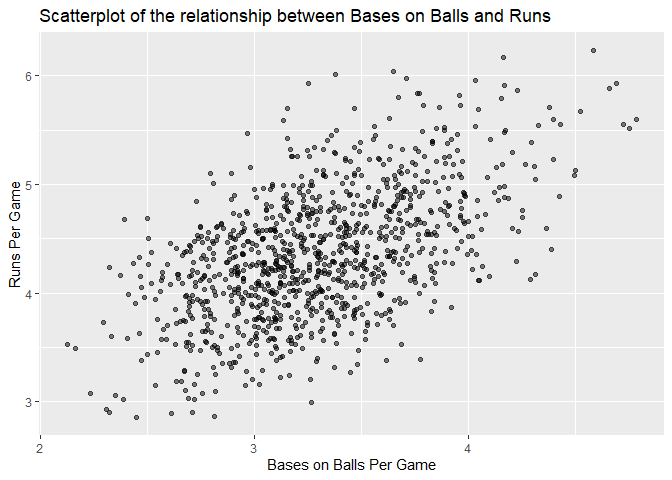

Study on Sabermetrics and Linear Regression
================
Juan Lamilla
09/04/2021

## Setup

``` r
knitr::opts_chunk$set(echo = TRUE)
library(Lahman)
library(tidyverse)
```

    ## -- Attaching packages --------------------------------------- tidyverse 1.3.0 --

    ## v ggplot2 3.3.3     v purrr   0.3.4
    ## v tibble  3.0.6     v dplyr   1.0.4
    ## v tidyr   1.1.2     v stringr 1.4.0
    ## v readr   1.4.0     v forcats 0.5.1

    ## -- Conflicts ------------------------------------------ tidyverse_conflicts() --
    ## x dplyr::filter() masks stats::filter()
    ## x dplyr::lag()    masks stats::lag()

``` r
library(dslabs)
team_stats <- Teams %>% filter(yearID %in% 1961:2001)
```

## Introduction

This is an R Markdown document used to organize and display the code I
have written for my case study in sabermetrics in my class for linear
regression. More specifically, this document highlights relations
between baseball players and their contributions to the team, and how we
can use linear regression to calculate their effectiveness.

``` r
team_stats %>%
  mutate(HR_per_game = HR / G, R_per_game = R / G) %>%
  ggplot(aes(HR_per_game, R_per_game)) + 
  geom_point(alpha = 0.5) + 
  ggtitle("Scatterplot of the relationship between HRs and Runs") +
  xlab("Home Runs Per Game") + ylab("Runs Per Game")
```

<!-- -->

``` r
team_stats %>%
  mutate(BB_per_game = BB / G, R_per_game = R / G) %>%
  ggplot(aes(BB_per_game, R_per_game)) + 
  geom_point(alpha = 0.5) + 
  ggtitle("Scatterplot of the relationship between Bases on Balls and Runs") +
  xlab("Bases on Balls Per Game") + ylab("Runs Per Game")
```

<!-- -->
